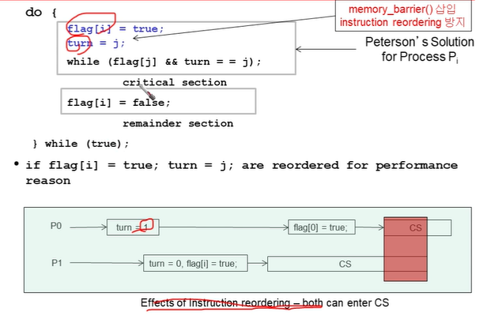
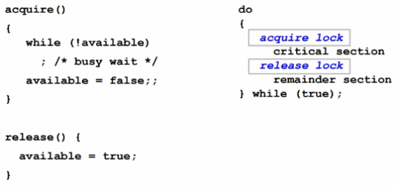
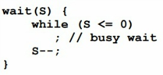

## Cooperating Process
- 한 프로세스의 결과가 다른 프로세스에게 영향을 끼칠 때 cooperating 관계라한다.
- code와 data를 포함하는 logical address를 공유한다.
- SM 또는 MP를 통해서 메세지 공유

### Indepenent process
- 한 프로세스의 실행 결과가 다른 프로세스에 아무런 영향을 주지 않을때 Independent process 관계라 한다.
- 동기화 기능 필요 x

### Advantages of process cooperation
- Information sharing
- Computation speed-up
- Modularity
- Convenience

## Producer-Consumer Problem
- Producer process와 Consumer process가 협력관계
- 버퍼를 가운데 두고 Producer가 버퍼에 데이터 생성, Consumer가 소비
- unbounded-buffer: 무한 사이즈
- bounded-buffer: 유한 사이즈


## Race Condition


counter++과 count--이 interleaving될 수 있다.


producer가 하나 생성하고 consumer가 하나 소비해서 값이 5가 될 수 있는데 위와 같은 경우가 발생해 값이 4나 6이 될 수 있다.
이런 경우를 Race Condition이라고 한다.


그러나 counter를 사용하지 않고 in, out만 사용하는 bounded buffer는 producer에선 in만 변화를 주고, consumer에선 out만 변화를 준다.
따라서 Race Condition이 일어나지 않는다. (변동이 한 process에서만 일어난다.)


다시 Race Condition을 정리해보면
- 두 개 이상의 process가 shared variable에 접근하는 것
- 공유 데이터의 최종 값은 누가 마지막으로 종료되는지에 따라 결정된다.
- 이를 해결하기 위해 atomic operation이 보장되어야 한다. (공유데이터를 concurrent하게 access하는 synchronized가 이루어져야한다.)

### atomic operation
- 이전 예제 였던 counter를 증가하거나 감소하는 코드 전체를 하나로 묶어 하나의 instruction처럼 되도록 해주는 것이다.
- 하나의 문장이 실행되는 동안 interrupt가 걸리지 않도록 보장해주는 것

### 동기화의 목적
- exclusive access: 공유 데이터를 한 프로세스만 사용할 수 있도록 보장해주는 것

## Critical Section Problem
- 총 n개의 프로세스가 있다고 가정
- 한 개의 shared data를 공유
- 각 프로세스는 critical section 코드가 있다.
- 공유 데이터를 접근하는 부분을 critical section이라고 한다. 그 외 부분에선 동기화 고려할 필요 x
- 결국 critical section problem이 뭐냐면 critical section에서 동기화를 보장해주는 것
- critical section안에서는 프로세스가 공유하는 데이터를 변경 가능

exclusive access를 보장하기 위해 critical section 앞뒤로 부가적인 section을 추가해줍니다.


remainder section : critical section이 아닌 section
entry section: 입장권 section
exit section: 입장권 반환 section

즉 entry exit는 추가적으로 구현 해줘야 된다.

## Solution to Critical-Section Problem
1. Mutual Exclusion: 어떤 프로세스 p가 critical section에 있는 코드를 실행중일때 다른 프로세스는 절대 critical section의 코드를 실행할 수 없다.
   - 이것만으로 동기화가 보장되지만 악영향이 존재한다.
2. Progress
   - critical section이 아닌 다른 부분에 있는 코드가 다른 process의 cs을 방해해선 안된다.
   - cs를 실행하는 코드가 한 개도 없는 경우 cs를 실행하고 싶어하는 프로세스가 여러 개 존재할 때 누가 먼저 실행될지 결정되는 것이 계속 미뤄져선 안된다.
3. Bounded Waiting
   - cs를 실행하고 싶은데 계속 다른 프로세스에 밀려 실행되지 못하고 있으면 안된다.

이 세 가지를 모두 만족할 때 cs의 올바른 솔루션이라고 할 수 있다.

## Critical-section Handling in OS
OS에서 cs를 핸들링하는 두개의 approaches 존재
- Preemptive: 어떤 프로세스가 커널모드 안에서 실행되도 preemtion 되는것
- Non-Preemptive: 어떤 프로세스가 커널모드에서 나오기 전에 preemtion 되지 못하는 것
- Preemptive한 경우에 동기화문제를 해결하기가 매우 까다롭다.


initial Attempt 1 to Solve Problem
```
do{
    while (turn == j);
           critical section
    turn = j;
           remainder section
   } while (true);
```
- only 2 processes, Pi and Pj
- turn - i => Pi can enter its critical section
- initially turn = i

1. Mutual Exclusion보장됨(turn 변수는 하나의 값만 가질 수 있기 때문)
2. progress1를 만족할 수 없다.(i로 초기화 됐기 때문에 i는 들어가고 싶지 않고 j가 들어가고 싶어도 j가 들어갈 수 없다.)
3. progress2를 만족할 수 없다.(i, j가 번갈아며 들어갈 수 밖에 없는 코드다.)


initial Attempt 2 to Solve Problem
```
do{
    flag[i] = true;
    while (flag[j]);
        critical section
    flag[i] = false;
        remainder section
   } while (true);

```
- initially flag[i] = flag[j] = false
- flag[i] = true => Pi ready to enter its critical section

flag를 통해 상대방이 먼저 들어가고 싶다는 의사를 밝혔으면 상대방이 먼저 들어갈 수 있다.
1. matual exclusion 보장됨
2. progress 보장이 만족되지 않는다. atomic이 보장되지 않음. flag[i]가 true가 되는 중에 flag[j]가 true가 되버리면 어떤 프로세스도 실행되지 않고 양보만 한다.
3. while(flag[j])와 flag[i] = true;의 위치를 바꾸면 matual exclusion도 보장되지 않음 처음에 초기화가 false로 되있기 때문에 둘다 들어갈 수 있음
4. bounded-waiting 요구사항을 만족하는가? nope 상대방 process가 true여서 cs실행을 하고 그 동안 자신 process가 remainder section을 실행하는동안 다시 상대방이 true가 되버리면 무한히 기다리게 된다.


## Peterson's Solution
두 프로세스가 두 개의 공유 변수를 사용함
- int turn;
- Boolean flag[2]
- initially flag[0]= flag[1] = false
 
turn이라는 변수는 누가 cs에 접근할지 정해주는 애

```
do{
    flag[i] = true;
    turn = j;
    while (flag[j] && turn == j);
            critical section
    flag[i] = false;
            remainder section
   } while (true);
```
상대방의 flag[j]가 false거나 내가 true면서 turn이 i로 되어있는 경우 cs에 들어갈 수 있다.

세 개의 조건을 다 만족하지만 2개가 아닌 n개의 프로세스로 확장되면 복잡해진다.

## Multiple-Process Solution: Bakery Algorithm
- CS for n processes
  - cs진입전에 프로세스는 번호표를 부여받는다. 번호표가 가장 적은 애가 cs에 먼저 진입
  - 여기서 문제가 각각 번호표가 유니크하지않다. 즉 여러 프로세스가 같은 번호를 받을 수 있다.
  - 따라서 같은 번호끼리 우선순위는 process id가 작은게 먼저 들어가는 걸로 한다.

choosing과 number라는 두 배열을 사용한다.

```
choosing[i] := true;
number[i] := max(number[0], number[1], ..., number[n-1])+1;
choosing[i] := false;
for j = 0 to n - 1
  do begin
      while choosing[j] do no-op; # 발급될때까지 대기
      while number[j] != 0 # 0으로 초기화했기 때문에 0이면 의미없음
        and (number[j], j) < (number[i], i) do no-op;
  end;
  critical section
number[i] = 0;
  remainder section
until false;
```
choosing[i] 가 true라는 것은 번호표를 발급받고 있는 상태라는 뜻이다.
number[i]가 발급되는 부분은 atomic하지 않기 때문에 같은 번호표가 존재할 수 있는 것

1. mutual exclusion 만족 `and (number[j], j) < (number[i], i)`로 인해 cs에 두 프로세스 접근 불가능
2. progress 만족
   - cs 밖에 있는 코드에서는 number가 0이다.
   - 1보다 큰 값을 갖는 경우에는 무조건 누군가는 들어간다.
3. bounded-waiting 만족 번호표가 오름차순이기 때문에

## Hardware Support for Synchronization: Memory barrier
- memory model
  - Strongly ordered
    - 어떤 memory modification이 한 프로세스에 의해서 변경되면 다른 모든 프로세스가 볼 수 있음
  - weakley ordered
    - 한 프로세스가 memory를 변경했더라도 다른 프로세스에는 반영되지 않음

즉 memory barrier는 값이 변경되지 않도록 reordering of instructions를 방지하는 것이다.

memory barrier()함수를 걸어두면 다른 모든 cpu가 변경된 내용을 인지해야만 다음 line 코드로 이동된다.


## Synchronization Hardware
atomic, 즉 인터럽트되지 않는 명령어를 사용한다.
- atomic: atomic구문으로 이루어진 구간은 처음부터 끝까지 preemption이 일어날 수 없다.(방해할 수 없다.)
- atomic hardware instruction을 구현하는 방법
  - acquire lock, release lock
  - HW 자체에서 test_and_set 명령어를 구현해준다.

1. test_and_set()
```
boolean test_and_set(boolean *target) {
    boolean rv = *target;
    *target = true;
    return rv;
```
공유변수 lock을 설정해서 cs 실행시엔 true, 아닐땐 false라 한다.

```
do{
    while(test_and_set(&lock));
    
    / cs
    
    lock = false;
    
    /remaainder section
} while(true);
``` 
처음 lock의 값을 false라 가정
test_and_set() 명령어에 의해 false값을 반환하고 lock의 값은 true로 바뀐다.
그리고 while 문을 빠져나와 cs에 들어간다.
cs에서의 작업이 끝나면 lock=flase; 로 바꿔줘 다른 프로세스가 cs를 이용할 수 있도록 해준다.

즉 어떤 프로세스가 cs를 사용하면 무조건 lock은 true상태가 된다.

2. compare_and_swap()
```
int compare_and_swap(int *valuem int expected, int new_value){
    int temp = *value;
    if(*value = expected){
        *value = new_value;
    }
    return temp;
}
```
```
do {

    while(compare_and_swap(&lock, 0, 1) != 0);
    
    / cs
    
    lock = 0;
    
    / remainder section
} while(true);
```
test_and_set과는 다르게 int 타입을 반환하고 인자로 3개가 들어간다. 공유변수인 lock의 주소, 예상 값, 새로운 값

처음 lock의 값을 0이라 가정(cs 사용가능)
compare_and_swap에 의해 0을 반환하고, lock을 새로운 값(1)로 설정

그리고 cs작업을 실행하고 작업을 마친 뒤에 lock의 값을 다시 0으로 설정해, 다른 프로세스가 이용할 수 있도록 한다.

이 두 방법은 bounded-waiting을 만족하지 못함

## Mutex Lock
프로세스는 임계구역에 들어가기전에 lock을 획득하고, 나올때는 lock을 반환해야한다.

mutext lock에서는 avilable이라는 변수를 갖고, 이 available 변수를 갖고 lock의 가용 여부를 판단한다.
```
    acquire() {
    	while(!available); // busy waiting
    	available = false;
    }
    release() {
    	available = true;
    }
```
만약 lock이 사용 가능하다면 acquire()를 호출해서 lock을 획득하고, 다른 프로세스가 접근하지 못하도록 available변수를 false로 변환한다.

lock을 반환할 때는 release()를 호출한다.


함수의 코드를 살펴보면 이전에 배운 test_and_set()과 비슷한 것을 알 수 있다.

이 mutex lock 방식은 Busy Waiting을 해야된다는 단점이 존재한다. cs에 들어가기 위해서 계속 acuire()를 호출하는 반복문을 실행한다.

lock이 사용가능해지기를 기다리면서 프로세스가 계속 반복 회전하고 있기 때문에 spinlock이라고도 부른다. 즉 busy waiting은 cpu cycle을 낭비하게 된다.

하지만 lock을 기다리는 동안은 context switching을 필요로 하지 않기 때문에 multiprocessing에서 spinlock이 사용된다.
-> 조금만 기다리면 바로 쓸 수 있다는 점을 이용해서 lock-unlock의 타임이 짧을 때 유용하다.

bounded-waiting은 보장되지 않는다.

## Semaphore
Mutext와 다른 점은 counting이 가능하다는 것이다. 가용할 수 있는 프로세스들을 동시에 실행시키는 것이 가능하다.

운영체제에서는 종종 카운팅 세마포어, 이진 세마포어를 구분한다. 여기서 이진 세마포어는 0과 1을 갖고 동작하고 mutex lock과 유사하게 동작한다.

카운팅 세마포어란
세마포어는 프로세스가 cs에 들어가려 할때 값이 감소하고, 임계구역의 작업을 끝내고 lock을 반납할 때 값이 증가한다. 만약 세마포어가 0이 된다면 모든 자원들이 프로세스들에 의해 모두 사용중이라는 것을 나타낸다.

이후 자원을 사용하려면 세마포어가 0보다 커지기를 기다려야 된다.

### busy waiting 해결하기
프로세스를 대기 큐에 넣고 대기 상태로 전환하여 다른 프로세스가 실행되도록 한다. -> wait()

임계구역을 나온 프로세스의 signal() 함수 호출에 따라 대기 상태인 프로세스가 준비 큐로 들어가 프로세스를 재시작하여 임계구역에 진입하게 된다.

block()과 wakeup()을 사용해 이를 해결한다.

block() 함수는 자기를 호출한 프로세스를 중지시킨다.

wakeup(P)는 봉쇄된 프로세스 P를 재시작한다.
- pooling 방식이 아닌 인터럽트 기반 방식으로 구현되며 빈번한 context switching이 발생한다.
- queue를 만들기 위해 링크드 리스트를 사용
-> cs가 짧으면 busy waiting, 길면 block & wake-up 방식을 사용한다.


### Deadlock and starvation (semaphore의 문제점)
deadlock
- p0는 p1이 Q를 놔주기를 p1은 p0이 s를 놔주기를 바랄 때를 말한다.(서로 기다리는 현상)

starvation
- 하나의 프로세스가 오랜기간 선택되지 못하여 실행되지 못 할 때를 말한다. 이는 프로세스가 임계구역을 기다릴 때 대기 큐에 들어가기 때문에 발생한다.

